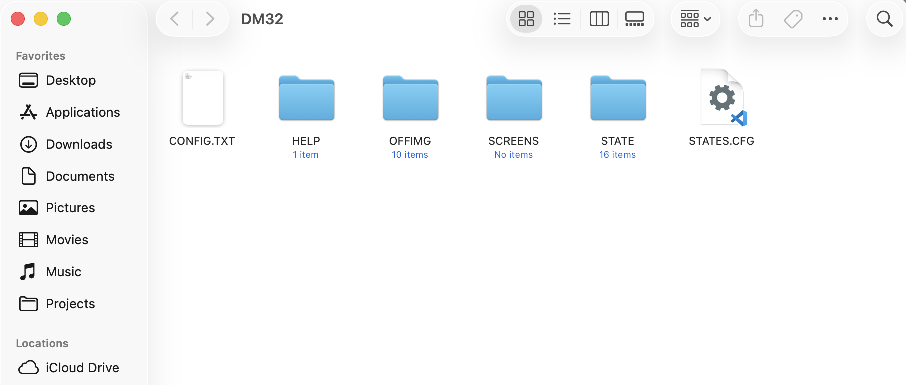

# DM32 Current Repository

Live snapshot of my own SwissMicros DM32 FAT drive. Updated as the calculator state changes with periodic named releases.

## File Structure
```
.
├── FAT/          # DM32 FAT drive contents
├── assets/       # Files for repo
└── README.md     # Repo information
```

Current Release version: [rel1-neonardo](https://github.com/jacober-calc/dm32/releases/tag/rel2-wayfinder)

Current Firmware: [DMCP5_flash_3.56_DM32-2.11](https://technical.swissmicros.com/dm32/firmware/)

## About Files



The DM32 exposes its internal storage as a USB mass storage device. This repo tracks the complete FAT drive contents—programs, states, and configuration—as a versioned backup and reference.

`README.md` and the [assets file](assets/) are repo metadata only; their contents are not part of the calculator state files.

## Commit/Release Convention

All commits are made ordinally (First Commit, Second Commit, etc.). Releases are made when a commit contains a change to the [DM32 FAT drive folder](FAT/) and these releases are also given unique names and tracked by a release number (rel12-Hilltop, rel45-Bogus, etc.). Commits are made as required and contain changes to the repo and may include a change to the DM32 folder, in which case a new Release will be created as well.

## Anticipated Usage

Clone and copy to your local drive to restore entire state or individual files to your own device. You can also download the latest release or browse previous releases to see past states.

## Hardware Information

[SwissMicros DM32](https://www.swissmicros.com/product/dm32) — modern RPN scientific calculator in the HP-32SII lineage. You can find more information about calculator states, memory, OFFIMGs and screencaptures on the [online version of the DM32 manual](https://technical.swissmicros.com/dm32/doc/dm32_user_manual.html).

## Programming Disclaimer

These are personal configuration files. Use at your own discretion.

### By jacober-calc for SwissMicros DM32

> - [SwissMicros Website](https://www.swissmicros.com)  
> - [DM32 product page](https://www.swissmicros.com/product/model-dm32)  
> - [SwissMicros full products page](https://www.swissmicros.com/products)  
> - [DM32 Online User Manual](https://technical.swissmicros.com/dm32/doc/dm32_user_manual.html)  
> - [SwissMicros Calculator Forum](https://forum.swissmicros.com/index.php)